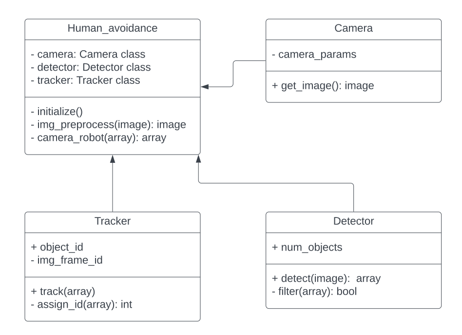
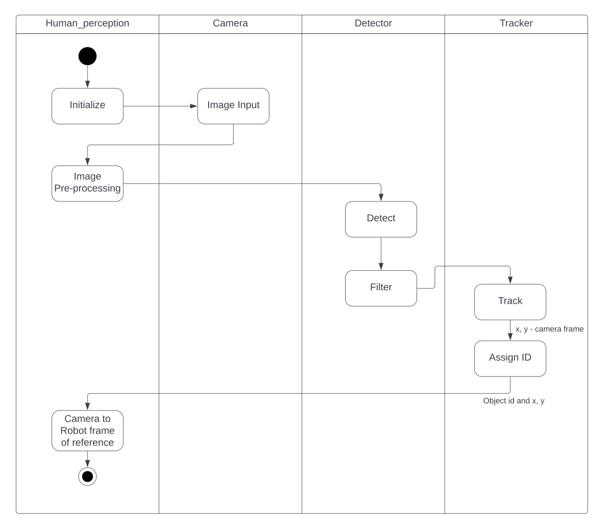
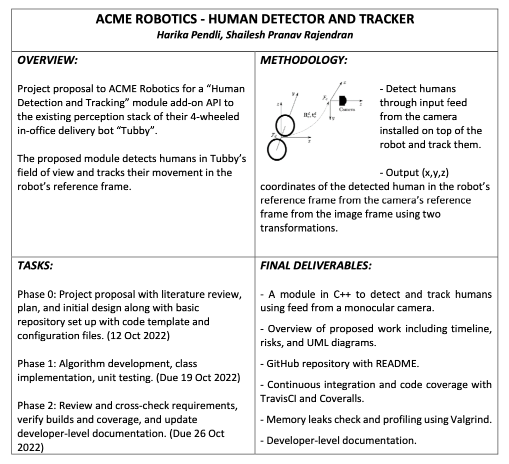

# Human Detection and Tracking

[](https://opensource.org/licenses/MIT)
[](https://github.com/shaileshpranav/Human_avoidance/actions/workflows/CI.yml)

## Overview
Human detection and tracking project for Midterm of course ENPM 808X

## Authors
- [Shailesh Pranav Rajendran](https://github.com/shaileshpranav)
- [Harika Pendli](https://github.com/harika-pendli)

## License 
```
MIT License

Copyright (c) 2022 Shailesh Pranav Rajendran, Harika Pendli

Permission is hereby granted, free of charge, to any person obtaining a copy
of this software and associated documentation files (the "Software"), to deal
in the Software without restriction, including without limitation the rights
to use, copy, modify, merge, publish, distribute, sublicense, and/or sell
copies of the Software, and to permit persons to whom the Software is
furnished to do so, subject to the following conditions:

The above copyright notice and this permission notice shall be included in all
copies or substantial portions of the Software.

THE SOFTWARE IS PROVIDED "AS IS", WITHOUT WARRANTY OF ANY KIND, EXPRESS OR
IMPLIED, INCLUDING BUT NOT LIMITED TO THE WARRANTIES OF MERCHANTABILITY,
FITNESS FOR A PARTICULAR PURPOSE AND NONINFRINGEMENT. IN NO EVENT SHALL THE
AUTHORS OR COPYRIGHT HOLDERS BE LIABLE FOR ANY CLAIM, DAMAGES OR OTHER
LIABILITY, WHETHER IN AN ACTION OF CONTRACT, TORT OR OTHERWISE, ARISING FROM,
OUT OF OR IN CONNECTION WITH THE SOFTWARE OR THE USE OR OTHER DEALINGS IN THE
SOFTWARE.

```
## UML


## Activity diagram


## Quad-Chart


## Links
[Phase-0 Proposal](https://github.com/shaileshpranav/Human_avoidance/blob/main/Proposal.pdf)

[Phase-0 Proposal Video](https://drive.google.com/file/d/1JcN-jdWsAfGG5XlVniN_F_-hbOWnSuIF/view?usp=sharing)


## Standard install via command-line
```
git clone --recursive https://github.com/shaileshpranav/Human_avoidance
cd <path to repository>
mkdir build
cd build
cmake ..
make
Run tests: ./test/cpp-test
Run program: ./app/shell-app
```

## Building for code coverage
```
sudo apt-get install lcov
cmake -D COVERAGE=ON -D CMAKE_BUILD_TYPE=Debug ../
make
make code_coverage
```
