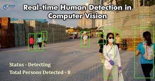
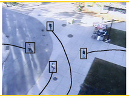

# Human Detection and Tracking

[](https://opensource.org/licenses/MIT)
[](https://github.com/shaileshpranav/Human_avoidance/actions/workflows/CI.yml)
[](https://coveralls.io/github/shaileshpranav/Human_avoidance?branch=main)

## Overview
Human detection and tracking project for Midterm of course ENPM 808X

Acme Robotics Inc. is a private company set to launch a 4-wheeled robot used to deliver packages inside office for an undisclosed multinational company next. This robot is set to debut early next year. It moves in the corridor at a walking pace. The package is stored inside of the robot and drives itself to the customer. They have given us complete ownership of designing and developing a new feature for this robot's perceeption stack -"Human detector and tracker". 

Object detection is a very important computer vision task. Human detection is the task of locating all instances of human beings present in an image, and it has been most widely accomplished by searching all locations in the image, at all possible scales, and comparing a small area at each location with known templates or patterns of people. Human tracking is the process of temporally associating the human detections within a video sequence to generate persistent paths, or trajectories, of the people. Human detection and tracking are generally considered the first two processes in a video surveillance pipeline, and can feed into higher-level reasoning modules such as action recognition and dynamic scene analysis. Object detection and tracking is of utmost importance for different kinds of applications such as safety, surveillance, man-machine interaction, driving assistance system, traffic monitoring. Finding people in images has attracted much attention in recent years for practical applications such as visual surveillance. The detection of a human being is important for abnormal event detection, human gait characterization, people counting, person identification and tracking, pedestrian detection, gender classification. Human detection and tracking are tasks of computer vision systems for locating and following people in video imagery.

This is an example of human detection.



And This is an example of human tracking.



In this module, we aim to build a module which when recieves video feed, starts detecting humans in the frame and gives ID to individual instances and tracks them over rest of the frames. These coordinates are then transformed into the robots reference frame and the final output is their (x,y,z) coordinate with respect to the robot reference frame.

## Authors
- [Shailesh Pranav Rajendran](https://github.com/shaileshpranav)
- [Harika Pendli](https://github.com/harika-pendli)

## License 
```
MIT License

Copyright (c) 2022 Shailesh Pranav Rajendran, Harika Pendli

Permission is hereby granted, free of charge, to any person obtaining a copy
of this software and associated documentation files (the "Software"), to deal
in the Software without restriction, including without limitation the rights
to use, copy, modify, merge, publish, distribute, sublicense, and/or sell
copies of the Software, and to permit persons to whom the Software is
furnished to do so, subject to the following conditions:

The above copyright notice and this permission notice shall be included in all
copies or substantial portions of the Software.

THE SOFTWARE IS PROVIDED "AS IS", WITHOUT WARRANTY OF ANY KIND, EXPRESS OR
IMPLIED, INCLUDING BUT NOT LIMITED TO THE WARRANTIES OF MERCHANTABILITY,
FITNESS FOR A PARTICULAR PURPOSE AND NONINFRINGEMENT. IN NO EVENT SHALL THE
AUTHORS OR COPYRIGHT HOLDERS BE LIABLE FOR ANY CLAIM, DAMAGES OR OTHER
LIABILITY, WHETHER IN AN ACTION OF CONTRACT, TORT OR OTHERWISE, ARISING FROM,
OUT OF OR IN CONNECTION WITH THE SOFTWARE OR THE USE OR OTHER DEALINGS IN THE
SOFTWARE.

```

## Links
- [Phase-0 Proposal](https://github.com/shaileshpranav/Human_avoidance/blob/main/Proposal.pdf)

- [Phase-0 Proposal Video](https://drive.google.com/file/d/1JcN-jdWsAfGG5XlVniN_F_-hbOWnSuIF/view?usp=sharing)

- [Product-log](https://docs.google.com/spreadsheets/d/13NfVb0g8LwvVlH9F1EcA1EnQb8gwcYmieM8Q2csQmX0/edit#gid=0)

- [Sprint Review](https://docs.google.com/document/d/1Nb_psVTufyzcFsdD67MJTqQvALrAlez0QEYVcEus4a4/edit)

- [Phase 1 Update Video](https://drive.google.com/file/d/1zdG5oJxihnf690Nj9lmH-NxazA3RiWn2/view?usp=sharing)

## Demo


## Design and Development process

We made use of ESC methodology for the initial design process which is by extraction of significant concepts (ESC). We have identified the classes of the future program and their responsibilities. The class relations have been explained through UML class diagrams which cn be found in the [UML revised folder](https://github.com/harika-pendli/Human_avoidance/blob/dev2/uml/revised/UML_final.png)

Our software team worked on this project through iterative software evolution and service processes. We engaged in Agile Iterative Development Process (AIP) through Test-Driven Development during the entire project period. Being a team of two programmers, we have decided to adopt pair programming and switch roles as navigator and drive as and when necessary.

## Algorithm and methodology


The perception pipeline flows as follows: command parser in data loader classes parses the arguments to retrieve the input to the pipeline (image/video), which then goes to the Human detector class which acts like a driver class. Here the yolo model config class and the transformation class intervenes to detect humans and get the depth or the distance of the humans from the camera respectively. We also have a Tracking stub class which we aim to update and release this functionality in the next version 0.02.

First, the class Human detector is initialized, which in turn initializes, the other two classes namely, the modelConfig class, and the data loader class. Here detection takes place for each frame (if provided with video input) or an image based on the pre-trained [YOLOv3 model](https://pjreddie.com/darknet/yolo/). This detection is then passed to the transformation class where the x,y,z coordinate in the robot frame is calculated and the y-coordinate (depth) or the distance of the person from the robot is calculated (transformation from camera frame to robot reference frame) and shown on the image or video output. Currently we have made a basic tracker system but we plan to release it in the next build.

For the unimplemented tracker class, we plan to do the following: 
The updated coordinates along with the frame will be sent to the tracker function of the Tracker class where detection and tracking will be managed by the [DeepSORT](https://github.com/nwojke/deep_sort) deeplearning model. Here the detected objects are assigned unique ids. This id along with the frame id as well as the coordinate of the object in the camera frame is saved in an array. This process is repeated until all the image frames are completed.

## Known Issues/Risks 

- Missed detection: It may happen that the model sometimes misses some human objects during detection. In such a case, deploying more than one and different models can be viable.

- Duplicate detections: It can happen due to low lighting or bad lighting conditions or bas resolution and quality of the video or the image.

##  Install Dependencies
- Ubuntu 20.04(LTS)
- CMake
- OpenCV
- Github CI
- Coveralls
- Git
```
sh dependencies.sh
```

## Build via command-line
```
git clone --recursive https://github.com/shaileshpranav/Human_avoidance
cd <path to repository>
cd input/
sh script.sh && cd ..
mkdir build && cd build
cmake ..
make
```
## Run Test:

    ./test/cpp-test
## Run program:
- For Image
```
./app/app --image=../input/1.png
```
- For video
``` 
./app/app --video=../input/video.mp4
```

## Building for code coverage
```
sudo apt-get install lcov
cmake -D COVERAGE=ON -D CMAKE_BUILD_TYPE=Debug ../
make
make code_coverage
```
## Plugins
- Google C++ Sytle
```
clang-format -style=Google -i your_file.cpp
```

- Cpplint

```
# You may need to install cpplint:
sudo apt install python3-pip
pip install cpplint

# read the cpplint manual to get an idea of what it does:
~/.local/bin/cpplint -h
#to run on a file:
cpplint "FIlename.cpp"
```

- cppCheck
```
cppcheck --enable=all --std=c++11 -I include/ --suppress=missingIncludeSystem $( find . -name *.cpp | grep -vE -e "^./build/" -e "^./vendor/" )
```
## Running Doxygen
```
sudo apt-install doxywizard
run doxywizard
```
